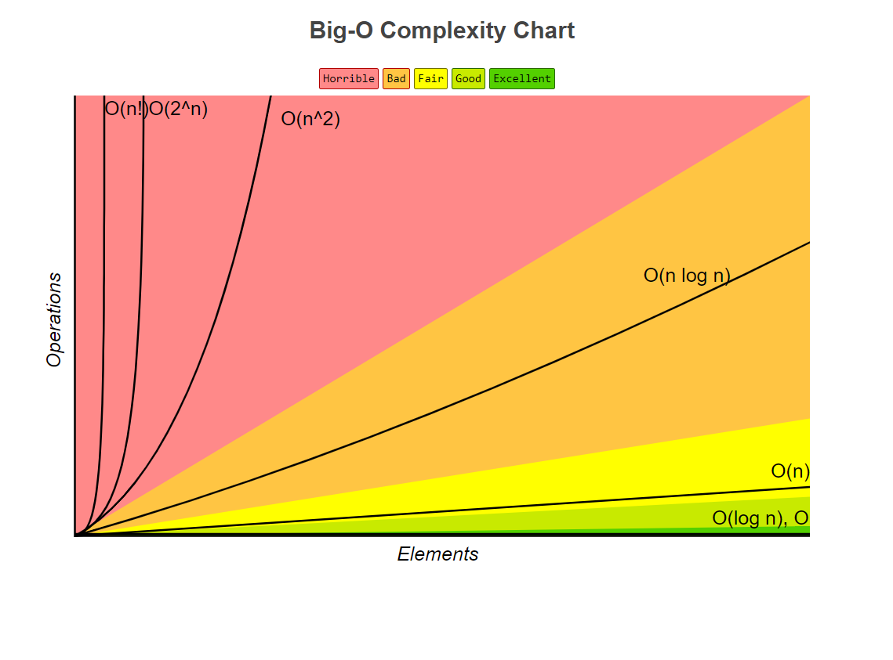
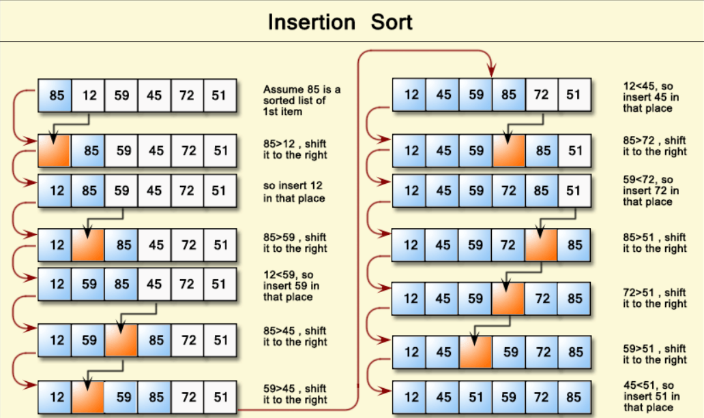

# DS-Algo-JS

Data structures and Algorithms in Javascript

[Mind Map!](https://coggle.it/diagram/W5E5tqYlrXvFJPsq/t/master-the-interview-click-here-for-course-link)

# Big O Cheat Sheet

## -Big Os

- O(1) Constant- no loops
- O(log N) Logarithmic- usually searching algorithms have log n if they are sorted (Binary Search)
- O(n) Linear- for loops, while loops through n items
- O(n log(n)) Log Liniear- usually sorting operations
- O(n^2) Quadratic- every element in a collection needs to be compared to ever other element. Two nested loops
- O(2^n) Exponential- recursive algorithms that solves a problem of size N
- O(n!) Factorial- you are adding a loop for every element
- Iterating through half a collection is still O(n)
- Two separate collections: O(a + b)
- Two nested collections: O(a \* b)

## -What can cause time in a function?-

- Operations (+, -, \*, /)
- Comparisons (<, >, ==)
- Looping (for, while)
- Outside Function call (function())

## -Rule Book

- Rule 1: Always worst Case
- Rule 2: Remove Constants
- Rule 3: Different inputs should have different variables. O(a+b).
  A and B arrays nested would be O(a\*b).
- Rule 4: Drop Non-dominant terms

## -What causes Space complexity?-

- Variables
- Data Structures
- Function Call
- Allocations

- Big-O Complexity Chart
  
- Common Data Structure Operations
  
- Array Sorting Algorithms
  

